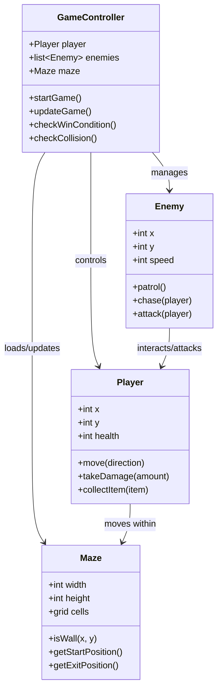

```mermaid
classDiagram
    class Player {
        +int x
        +int y
        +int health
        +move(direction)
        +takeDamage(amount)
        +collectItem(item)
    }

    class Enemy {
        +int x
        +int y
        +int speed
        +patrol()
        +chase(player)
        +attack(player)
    }

    class Maze {
        +int width
        +int height
        +grid cells
        +isWall(x, y)
        +getStartPosition()
        +getExitPosition()
    }

    class GameController {
        +Player player
        +list~Enemy~ enemies
        +Maze maze
        +startGame()
        +updateGame()
        +checkWinCondition()
        +checkCollision()
    }

    GameController --> Player : controls
    GameController --> Enemy : manages
    GameController --> Maze : loads/updates
    Enemy --> Player : interacts/attacks
    Player --> Maze : moves within
```