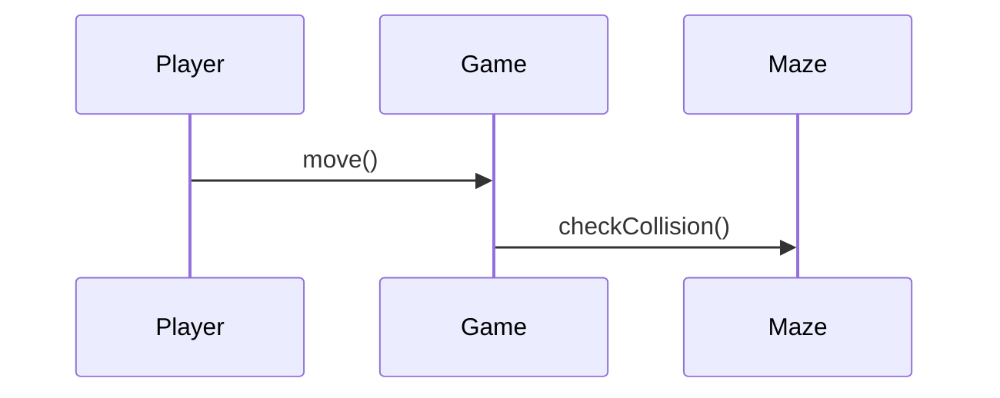

# 🎮 PROG1400 – OOP Memory Aid

### Pac-Man Build Process Edition

*(Student Concept Dictionary)*

---

# 🔹 Core OOP Principles

---

## 🧱 Object

**What it is:**
A thing in your program with **data (attributes)** and **behavior (methods)**.

**Pac-Man Example:**
Pac-Man, Ghost, Pellet, Maze, GameController

**Test Yourself:**
Can I describe what this object is responsible for in one sentence?

---

## 🏷 Class

**What it is:**
A blueprint used to create objects.

**In Python:**

```python
class Player:
    pass
```

**Think:**
A class defines structure. An object is an instance.

---

## 🔐 Encapsulation (LO1, LO2)

**What it means:**
An object controls its own data and how it is changed.

**Pac-Man Example:**
Only the Player class updates its own position.

**Red Flag:**
If another class directly modifies internal data → encapsulation is broken.

---

## 🎭 Abstraction (LO1, LO4)

**What it means:**
Focus on *what* something does, not *how* it does it.

**Pac-Man Example:**
Both Ghost and Player “move” — details differ.

**In UML:**
You model behavior without writing implementation code.

---

## 🧬 Inheritance (LO1, LO2)

**What it means:**
A class derives from another class to reuse behavior.

**Pac-Man Example:**
Ghost inherits from Character.

**Purpose:**
Reduce duplication.

---

## 🎯 Polymorphism (LO1, LO2)

**What it means:**
Different objects respond differently to the same method.

```python
player.move()
ghost.move()
```

Same method name → different behavior.

---

## 🔗 Aggregation

**What it means:**
A “has-a” relationship.

**Pac-Man Example:**
Game has many Ghosts.
Maze has many Pellets.

**In UML:**
Shown with associations.

---

## 📜 Interface (Conceptual)

**What it means:**
A contract that defines behavior.

**Example:**
Anything that can move must implement `move()`.

---

# 🔹 UML Concepts (LO4)

---

## 📦 UML Class Diagram

**Purpose:**
Show structure of your system.

Includes:

* Classes
* Attributes
* Methods
* Relationships

**Ask Yourself:**
Does my UML match my code?

---

## 🔄 UML Sequence Diagram

**Purpose:**
Show interactions over time.

**Pac-Man Example:**



Think:
Who talks to who? In what order?

---

## 🧩 UML Evolution (Your Course Model)

| Version | Meaning                     |
| ------- | --------------------------- |
| v0      | Idea only                   |
| v1      | Initial structure           |
| v2      | Encapsulation + inheritance |
| v3      | Interfaces                  |
| v4      | Collections                 |
| Final   | Clean professional model    |

---

# 🔹 Programming & Design Concepts (LO2)

---

## 🧠 Responsibility

Each class should have **one clear job**.

**Bad:**
Game class handles everything.

**Good:**
Maze handles layout.
Player handles movement.

---

## 🏗 Separation of Concerns

Each part of the system has a distinct role.

Think:

* Model
* Game logic
* Input
* Rendering

---

## 🔁 Refactoring

Improving structure without changing behavior.

You do this:

* After midterm
* Before final submission

---

# 🔹 GitHub & Workflow (LO3)

---

## 🗂 Repository

Your project container.

Includes:

* src/
* docs/uml/
* README.md

---

## 📝 Commit

A snapshot of changes.

**Good commit message:**

```
Added UML v2 with inheritance hierarchy
```

---

## 🌍 Local vs Remote

Local → Your machine
Remote → GitHub server

You push local commits to remote.

---

## 🔄 Version Control

Tracks history of your code.

Purpose:

* Undo mistakes
* Show progress
* Collaborate professionally

---

# 🔹 Mermaid (Midterm Critical)

---

## 📊 Mermaid

Markdown-based diagram tool.

Used for:

* Class diagrams
* Sequence diagrams

Runs in VS Code.

---

## 🤖 Copilot Usage

Allowed — but:

* You must modify output.
* You must understand what it generated.
* You must explain it.

---

# 🔹 Midterm Practical Concepts

---

You must demonstrate:

* UML creation
* GitHub workflow
* Python OOP
* Ability to explain your design

The instructor evaluates:

* Process
* Reasoning
* Problem solving
* Hands-on skill

---

# 🔹 Red Flag Checklist

If your project has:

❌ One giant class
❌ UML doesn’t match code
❌ One big commit at end
❌ Blind Copilot use
❌ No clear responsibilities

You need revision.

---

# 🔹 Professional Thinking Model

Think like this:

```text
What objects exist?
What is each responsible for?
How do they interact?
How is it modelled?
How is it implemented?
How is it versioned?
```

That’s the entire course.

---

# 🔹 One-Sentence Course Summary (Memory Trigger)

Design it.
Model it.
Implement it.
Version it.
Refine it.

