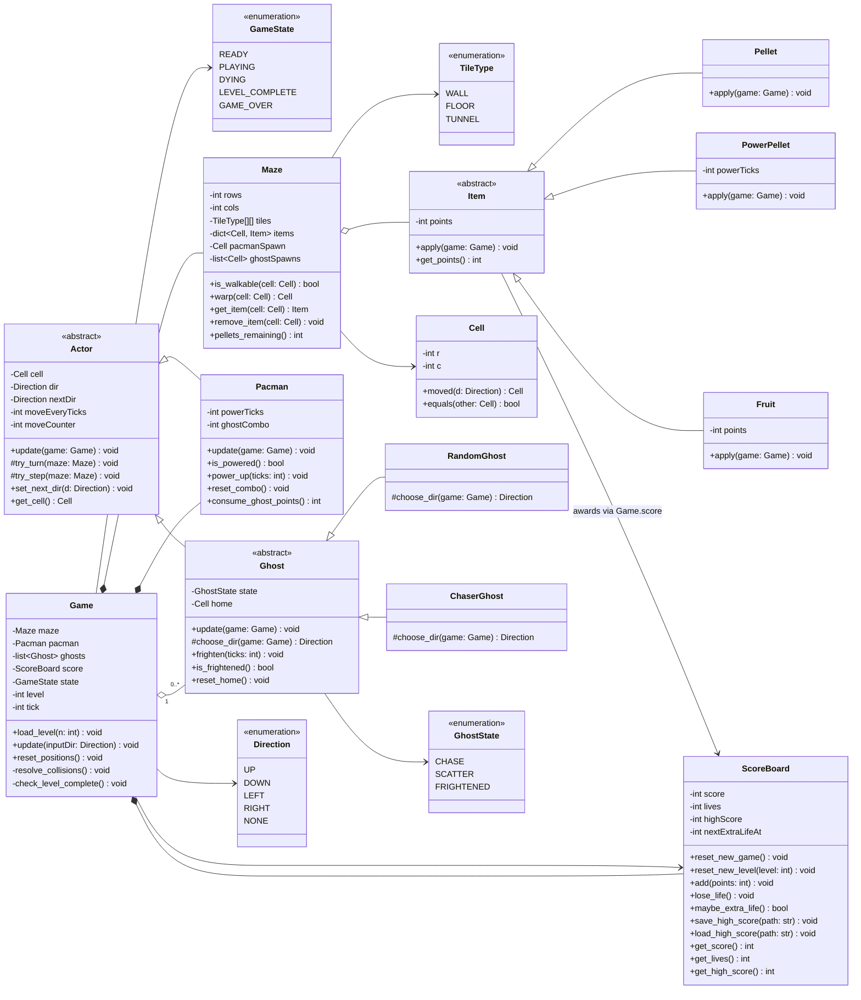
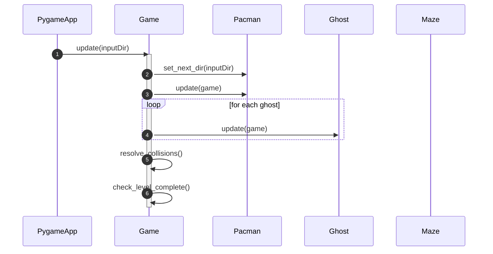
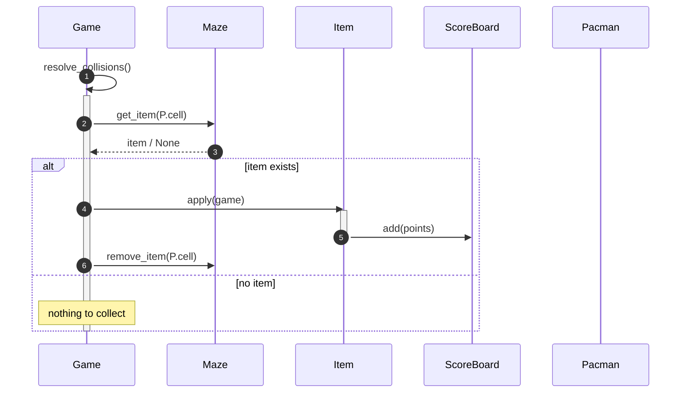
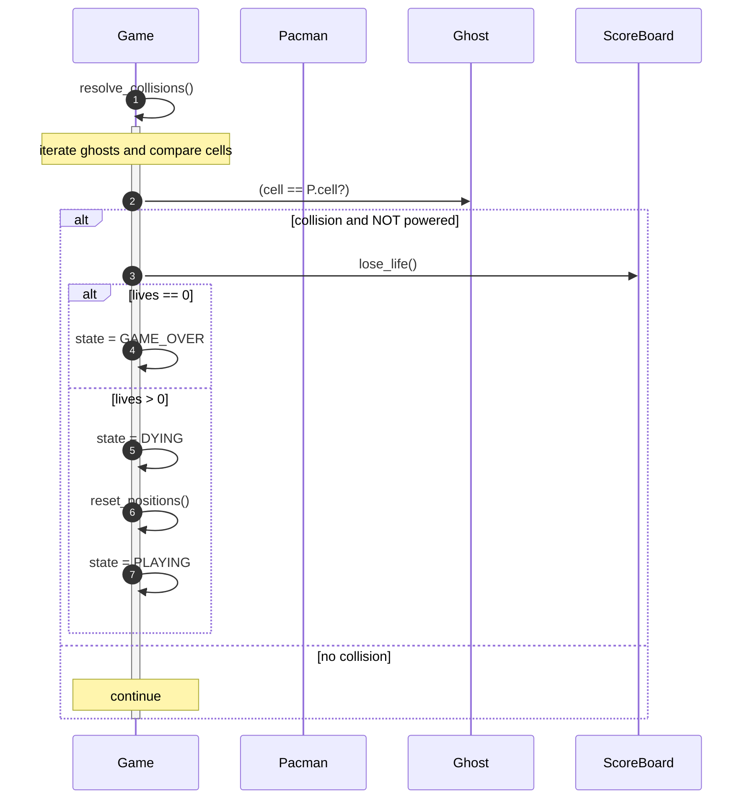
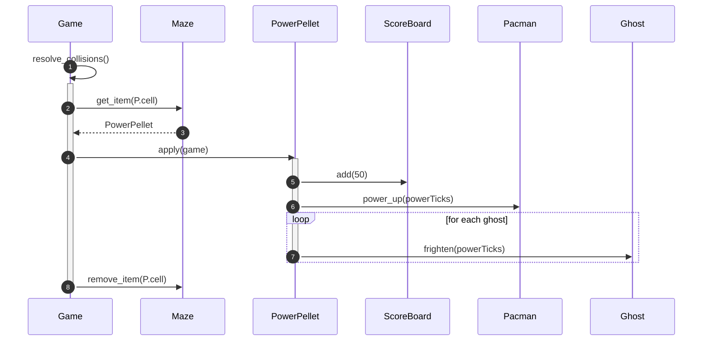
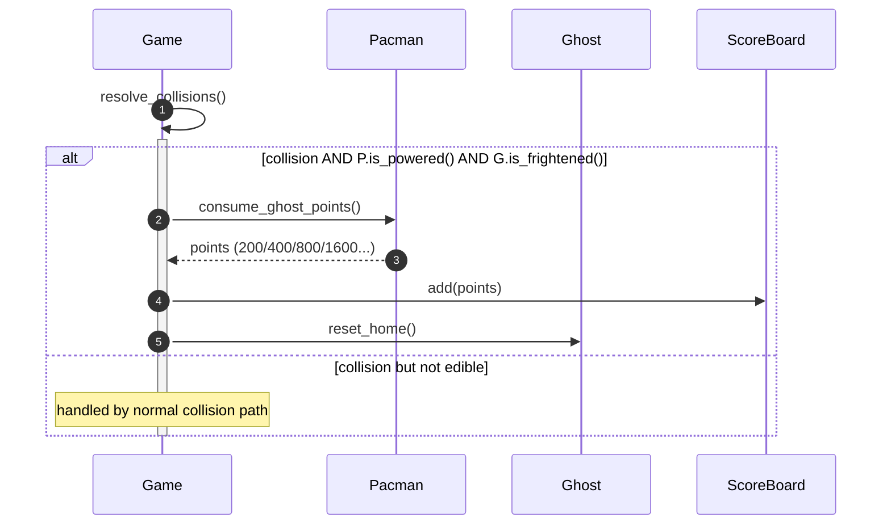
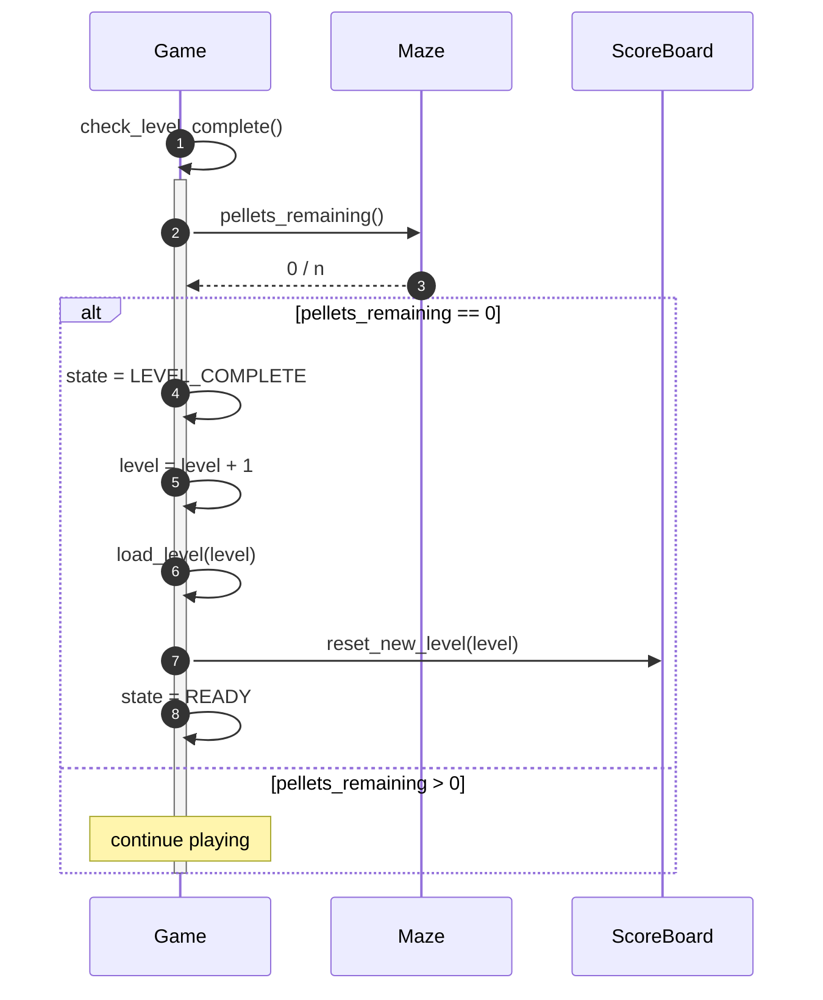

# Pac‑Man (Tile‑by‑Tile, Python + Pygame) — **Design Pack (Fillable Version)**

> **Student Name(s):** ________________________________  
> **Section / Lab:** _________________________________  
> **Instructor:** ____________________________________  
> **Date:** _________________________________________  
> **Project Repo Link:** _____________________________  

---

## 0) Quick Start: How to Complete This Document
Use this document as your “single source of truth” from Week 3 onward.

**Recommended workflow (repeat for each milestone):**
1. Update **Rules** (what the game must do)
2. Update **CRC** (who does what)
3. Update **UML** (structure + behavior)
4. Update **Traceability** (prove rule → design → code)

**Minimum submission requirements:**
- At least **1 brief**, **1 rules spec**, **1 CRC deck**, **1 class diagram**, **sequence diagrams #1–#6**, and **3 traceability entries**.

---

## 1) Project Brief (Fillable)

### 1.1 Project Title
**Title:** ___________________________________________________________

### 1.2 Overview (3–6 sentences)
Describe the player’s goal, how the game plays, and what makes it “Pac‑Man‑like.”

**Prompt:**
- What does the player control?
- What is the win condition?
- What causes losing a life?

> **Write here:**


### 1.3 Goals (Learning + Product)

#### Learning Goals (OOP + process)
Pick at least 3 (or write your own):
- [ ] Encapsulation (state + methods inside classes)
- [ ] Inheritance (Actor base, Ghost subclasses)
- [ ] Polymorphism (different `choose_dir()` and `apply()`)
- [ ] Composition (Game owns Maze, ScoreBoard, etc.)
- [ ] Process discipline (Brief → Rules → CRC → UML → Implementation)
- [ ] Debugging using UML sequence diagrams

> **Write here (your top 3 learning goals):**


#### Product Goals (gameplay)
Pick at least 3 (or write your own):
- [ ] Pac‑Man moves tile-by-tile and respects walls
- [ ] Pellets and power pellets work with scoring
- [ ] Ghosts move and cause life loss on collision
- [ ] Powered mode allows eating ghosts with combo scoring
- [ ] Level completion and next level loading
- [ ] High score saving/loading

> **Write here (your top 3 product goals):**


### 1.4 Constraints (Must‑Have)
Check off each constraint and add any additional ones.
- [ ] Python 3.x + Pygame
- [ ] **Tile‑by‑tile** movement only
- [ ] Levels from ASCII text files (`levels/level1.txt`, etc.)
- [ ] Use **Variant A architecture** (or instructor-approved equivalent)
- [ ] Include scoring, lives, and level completion

**Additional constraints (if any):**
- [ ] ________________________________________________________________
- [ ] ________________________________________________________________

### 1.5 Non‑Goals (Out of Scope)
List features you will not implement (helps prevent scope creep).

**Examples:** exact arcade AI, spritesheets, online leaderboard.

> **Write here (3+ non-goals):**
1) _________________________________________________________________
2) _________________________________________________________________
3) _________________________________________________________________

### 1.6 Definition of Done (Success Criteria)
Write **testable** statements.

> **Write at least 6:**
- [ ] ________________________________________________________________
- [ ] ________________________________________________________________
- [ ] ________________________________________________________________
- [ ] ________________________________________________________________
- [ ] ________________________________________________________________
- [ ] ________________________________________________________________

### 1.7 Controls
Fill in your control scheme.
- Move Up: __________  Move Down: __________  Move Left: __________  Move Right: __________
- Restart: __________  Quit: __________  Pause (optional): __________

---

## 2) Game Rules Specification (Fillable)

> **Rule style:** numbered, testable, preferably **IF… THEN…**.

### 2.1 Movement Rules
**M1.** IF __________________________________ THEN ________________________________.

**M2.** IF __________________________________ THEN ________________________________.

**M3.** IF __________________________________ THEN ________________________________.

### 2.2 Maze / Walls / Tunnels
**Z1.** IF __________________________________ THEN ________________________________.

**Z2.** IF __________________________________ THEN ________________________________.

### 2.3 Items & Scoring
**S1.** Pellet (`.`): points = ______; removed after collection? [ ] Yes [ ] No

**S2.** Power pellet (`o`): points = ______; power duration = ______ ticks

**S3.** Fruit (`F`, optional): points = ______; appears when? _________________________

**S4.** Extra life rule (optional): threshold(s) ________________________________

### 2.4 Ghost Behavior
**G1.** RandomGhost rule: __________________________________________________________

**G2.** ChaserGhost rule: __________________________________________________________

**G3.** Ghost speed rule (ticks per move): RandomGhost ______  ChaserGhost ______

### 2.5 Collisions & Lives
**C1.** IF Pac‑Man collides with __________________ THEN ____________________________.

**C2.** Lives start at ______; when lives = 0 THEN _________________________________

### 2.6 Power Mode & Combo
**P1.** When powered, ghosts are _________________________________________________

**P2.** Combo scoring values: ______________________________________________________

**P3.** Combo resets when: _________________________________________________________

### 2.7 Level Progression
**L1.** Level completes when: ______________________________________________________

**L2.** Next level loading rule: ___________________________________________________

---

## 3) CRC Deck (Fillable)

### 3.1 CRC Instructions (2-minute guide)
- **Responsibilities** are verbs (e.g., “updates movement”, “checks collisions”).
- **Collaborators** are other classes (e.g., Maze, ScoreBoard).
- If a class has more than **7 responsibilities**, consider splitting it.

### 3.2 CRC Card Template (Duplicate for each class)

```text
┌──────────────────────────────────────────────────────────────────────┐
│ CLASS (Name):                                                        │
├──────────────────────────────────────────────────────────────────────┤
│ RESPONSIBILITIES (verbs):                                             │
│  1)                                                                  │
│  2)                                                                  │
│  3)                                                                  │
│  4)                                                                  │
│                                                                      │
├──────────────────────────────────────────────────────────────────────┤
│ COLLABORATORS (classes it talks to):                                  │
│  •                                                                   │
│  •                                                                   │
│                                                                      │
├──────────────────────────────────────────────────────────────────────┤
│ KEY DATA / KNOWS (fields/state it owns):                              │
│  •                                                                   │
│  •                                                                   │
└──────────────────────────────────────────────────────────────────────┘
```

### 3.3 Required CRC Cards (Variant A)
Create CRC cards for each:
- `Game`, `Maze`, `Cell`, `Actor`, `Pacman`, `Ghost`, `RandomGhost`, `ChaserGhost`
- `Item`, `Pellet`, `PowerPellet`, (optional `Fruit`), `ScoreBoard`
- Enums: `GameState`, `Direction`, `TileType`, `GhostState`

**CRC Completion Checklist**
- [ ] Each class has 3–7 responsibilities
- [ ] Collaborators are named classes
- [ ] Each responsibility maps to at least one method in your code

---

## 4) UML (Fillable)

### 4.1 UML Class Diagram — Variant A (Provided)
> If you change the architecture, you must explain why and keep responsibilities clear.



### 4.2 UML Sequence Diagrams — Variant A (Provided)

> **Prompt:** For each diagram, write 1–2 sentences explaining what it guarantees.

#### Sequence #1 — Tick Update Flow
**Guarantee (write):** _____________________________________________________________



#### Sequence #2 — Pellet Pickup + Scoring
**Guarantee (write):** _____________________________________________________________



#### Sequence #3 — Pacman vs Ghost (Lose Life + Reset)
**Guarantee (write):** _____________________________________________________________



#### Sequence #4 — Power Pellet (Power Up + Frighten)
**Guarantee (write):** _____________________________________________________________



#### Sequence #5 — Eat Ghost (Combo Points + Reset Home)
**Guarantee (write):** _____________________________________________________________



#### Sequence #6 — Level Complete (Advance Level)
**Guarantee (write):** _____________________________________________________________



---

## 5) Traceability (Fillable)

### 5.1 Traceability Requirements
- Minimum: **3 trace entries**
- Recommended: **5 trace entries** (one per major milestone)

### 5.2 Traceability Entry Template (Copy 3–5 times)

```text
TRACE ENTRY #:

RULE ID + TEXT:

CRC (Class → Responsibility):

UML Class Diagram (Class.method):

UML Sequence Diagram (Diagram # + messages):

Code Location (file: method):

Test Evidence (steps + expected result):

Edge Cases / Notes:
```

### 5.3 Traceability Entry #1 (Fill)

```text
TRACE ENTRY #1

RULE ID + TEXT:

CRC (Class → Responsibility):

UML Class Diagram (Class.method):

UML Sequence Diagram (Diagram # + messages):

Code Location (file: method):

Test Evidence (steps + expected result):

Edge Cases / Notes:
```

### 5.4 Traceability Entry #2 (Fill)

```text
TRACE ENTRY #2

RULE ID + TEXT:

CRC (Class → Responsibility):

UML Class Diagram (Class.method):

UML Sequence Diagram (Diagram # + messages):

Code Location (file: method):

Test Evidence (steps + expected result):

Edge Cases / Notes:
```

### 5.5 Traceability Entry #3 (Fill)

```text
TRACE ENTRY #3

RULE ID + TEXT:

CRC (Class → Responsibility):

UML Class Diagram (Class.method):

UML Sequence Diagram (Diagram # + messages):

Code Location (file: method):

Test Evidence (steps + expected result):

Edge Cases / Notes:
```

---

## 6) ASCII Level Legend (Fillable)

### 6.1 Symbol Map
Confirm your symbol mapping (edit if needed):
- `#` = ____________________________
- ` ` = ____________________________
- `.` = ____________________________
- `o` = ____________________________
- `P` = ____________________________
- `G` = ____________________________
- `T` = ____________________________
- `F` = ____________________________

### 6.2 Level Files Included
List your level files and what’s special about each.
- `levels/level1.txt`: ________________________________________________
- `levels/level2.txt`: ________________________________________________
- `levels/level3.txt` (optional): ______________________________________

---

## 7) Implementation Plan (Fillable)

> **Prompt:** Break the build into milestones (movement → items → ghosts → power → levels).

### Milestone Plan
- **Milestone 1 (Movement + render):** ________________________________
- **Milestone 2 (Loader + pellets + score):** __________________________
- **Milestone 3 (Ghost + lives + reset):** _____________________________
- **Milestone 4 (Power + combo):** ____________________________________
- **Milestone 5 (Levels + high score):** _______________________________

---

## 8) Reflection (Fillable)

1) What changed from your brief to your implementation?

> _____________________________________________________________________

2) Which CRC card changed the most, and why?

> _____________________________________________________________________

3) Which sequence diagram helped you debug the most?

> _____________________________________________________________________
