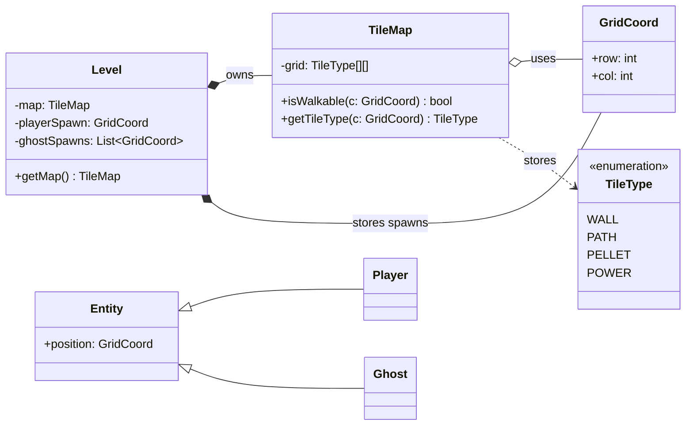
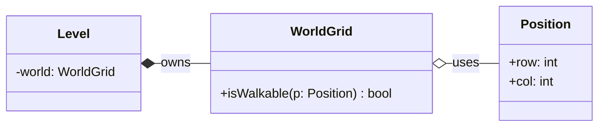

# 🧩 PROG1400 — Workshop 3

## Software Modelling & UML Diagramming Using Mermaid

*(Pac-Man Case Study → Your Game)*

---

## 1. Assignment Details

**Course:** PROG1400 – Object-Oriented Programming
**Workshop:** 3
**Title:** Software Modelling & UML Diagramming (Mermaid)
**Type:** Guided Design Workshop
**Estimated Time:** 2–3 hours
**Prerequisite:** Workshop 2 — CRC / Responsibility Table
**Tools Required:**

* Web browser
* Mermaid ([https://www.mermaid.ai/app/login](https://www.mermaid.ai/app/login))

**Learning Outcome Addressed:**

> **Outcome 4 — Develop an object-oriented solution utilizing software modelling design documentation.**

---

## 2. Overview / Purpose

In professional software development, programmers do not begin by writing code.

They begin by **modelling the system**.

In Workshop 2, you identified the objects in your game and defined what each object is responsible for using a **CRC (Class–Responsibility–Collaborator) table**.

In this workshop, you will take the next step:

> **You will convert your CRC thinking into UML design documentation.**

You will study a Pac-Man example and then create UML diagrams for **your own game idea** using **Mermaid**.

No programming is required.

---

## 3. Learning Objectives

By the end of this workshop, you will be able to:

* Explain what UML is and why it is used
* Understand UML class diagrams and relationships
* Convert CRC tables into UML structure
* Model a world grid / maze using object-oriented design
* Create UML diagrams using Mermaid code
* Share professional design documentation

---

## 4. Learning Outcomes Addressed

This workshop supports:

✔ Outcome 4 — Software modelling design documentation
✔ Object-oriented design thinking
✔ Professional software communication

---

# 🧠 Part 1 — What Is UML?

**UML (Unified Modeling Language)** is a standard way to visually describe software systems.

UML helps developers:

* plan before coding
* organize responsibilities
* understand structure
* communicate design ideas
* prevent messy “everything in one class” programs

UML is not code.

Instead, UML describes:

* what exists
* how parts relate
* who owns what

Think of UML as **blueprints for your program**.

---

# 📘 Understanding UML Class Diagrams

A **UML Class Diagram** shows the **structure** of a software system.

A class diagram shows:

* **Classes** — blueprints for objects
* **Attributes** — data stored by a class
* **Methods** — actions a class can perform
* **Relationships** — how classes connect

Each class is drawn as a box with three sections:

```
-----------------------
Class Name
-----------------------
Attributes
-----------------------
Methods
-----------------------
```

You are not expected to include every detail.
Clarity matters more than complexity.

---

## UML Relationship Types Used in This Course

| Relationship        | Meaning                 |
| ------------------- | ----------------------- |
| **Association**     | Objects communicate     |
| **Composition (◆)** | One object owns another |
| **Aggregation (◇)** | One object uses another |
| **Inheritance**     | “is-a” relationship     |

You do not need to use every relationship type —
use only what helps explain your design.

---

# 🔄 From CRC to UML

### Review: What you already have

From Workshop 2, you already created:

* an object list
* responsibilities
* collaborators

This becomes the **input** for UML.

CRC answers:

> *What does this object do?*

UML answers:

> *How is this object structured and how does it relate to others?*

CRC helps you think.
UML helps you organize.

---

# 🎮 UML Diagram Types Used in This Course

| Diagram              | Purpose               |
| -------------------- | --------------------- |
| CRC table            | Identify objects      |
| UML class diagram    | Structure & ownership |
| UML sequence diagram | Object interaction    |
| UML state diagram    | Behaviour over time   |

This workshop focuses on **UML class diagrams**.

---

# 🧱 Part 2 — World Grid / Maze Representation

Many games — including Pac-Man — use a **grid-based world**.

The world includes:

* rows and columns
* tiles (walls, paths, pellets, power pellets)
* defined spawn locations
* movement rules

Before movement or AI can exist, the **world structure** must be designed.

---

## Core OOP & Design Principles Applied

This workshop applies:

* **Encapsulation** — objects protect their data
* **Abstraction** — objects expose actions, not internals
* **Single Responsibility** — one class, one job
* **Separation of Concerns** — world ≠ player
* **Maintainability** — rules live in one place

---

# 🧪 Part 3 — Pac-Man World UML (Demo)

This UML diagram models **world structure only**.

It does not model:

* movement logic
* collisions
* AI
* scoring

Those are added later.



---

## What This Diagram Shows

* `Level` **owns** the TileMap
* `TileMap` **owns** the grid
* Entities will later **query** the TileMap
* Spawn points are data, not behaviour
* The world is separate from the player

This structure prevents logic from being scattered throughout the program.

---

## 📘 Important Design Note — Please Read

> **Player and Ghost are placeholders.**

At this stage:

* behaviour is not designed yet
* entities simply exist within the world

Complex logic will be added gradually.

This is how professional software is built — in layers.

---

# 🧭 UML Evolution Roadmap

Your UML will evolve across the semester:

| Version | Focus                            |
| ------- | -------------------------------- |
| v0      | CRC responsibilities             |
| v1      | World + entities (this workshop) |
| v2      | Movement (sequence diagram)      |
| v3      | Collectibles & scoring           |
| v4      | Ghost inheritance                |
| v5      | Ghost state diagram              |
| v6      | Collision interaction            |
| v7      | Game flow                        |

Design documentation grows alongside your program.

---

# 🧰 Part 4 — Using Mermaid

All UML diagrams in this course must be created using **Mermaid**.

### Access Mermaid

👉 [https://www.mermaid.ai/app/login](https://www.mermaid.ai/app/login)

You may sign in using:

* Google
* GitHub
* Email account

---

## Mermaid Starter Template



Modify this to match your game design.

---

# 🛠 Part 5 — Student Task

Create a **UML Class Diagram** for your own game.

### Requirements

* At least **5 classes**
* Based on your CRC table
* World or board structure included
* Position / coordinate class
* At least one ownership relationship
* Mermaid syntax only

---

# ✍️ Part 6 — Reflection

Write 6–10 sentences answering:

1. Which class has the most responsibility?
2. Where did you apply encapsulation?
3. How does your design prevent scattered logic?
4. What do you expect to change later?

---

# 📦 Part 7 — Deliverables

Submit:

1. Mermaid diagram (share link)
2. Reflection paragraph

Email your diagram link to:

📧 **[davisboudreau@nscc.ca](mailto:davisboudreau@nscc.ca)**

Include your name and game title.

---

## ✅ Workshop Summary

In this workshop you learned how to:

* move from CRC to UML
* design world structure before coding
* apply object-oriented design principles
* create UML using Mermaid
* build documentation that evolves over time

This is how real software is designed.

---
