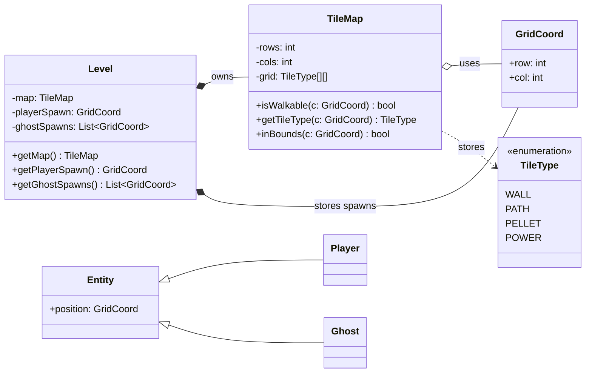
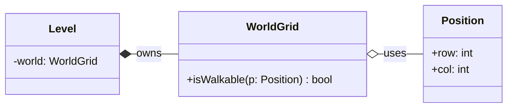

# 🧩 PROG1400 — Workshop 3

## UML Class Diagramming: World Grid / Maze Representation

---

## 1. Workshop Overview

In Workshop 2, you identified the objects in your game and defined what each object is responsible for using a **CRC (Class–Responsibility–Collaborator) table**.

In this workshop, you will take the next step in object-oriented design:

> **You will convert your CRC thinking into a UML Class Diagram.**

This workshop focuses on designing the **world structure** of your game — not gameplay logic yet.

You will study a Pac-Man example, then use it as a guide to build a UML class diagram for **your own game idea**.

No code is written in this workshop.

---

## 2. Learning Outcome

This workshop supports:

**Outcome 4**
*Develop an object-oriented solution utilizing software modelling design documentation.*

---

## 3. What is UML (in simple terms)

**UML (Unified Modeling Language)** is a standard way to draw and explain how software is structured.

UML helps you:

* plan before coding
* understand where responsibilities belong
* design clean object-oriented systems
* avoid messy “everything in one class” programs

Think of UML as **blueprints for your program**.

---

## 4. UML Diagram Types Used in This Course

Throughout the semester, you will use four UML tools:

1. **CRC / Responsibility table**
   → identifies objects and responsibilities (Workshop 2)

2. **UML Class Diagram**
   → shows structure and ownership (**Workshop 3 — today**)

3. **UML Sequence Diagram**
   → shows how objects communicate (movement, collisions)

4. **UML State Diagram**
   → shows how behaviour changes over time (ghost modes)

Each diagram answers a different design question.

---

## 5. Today’s Focus: World Grid / Maze Representation

Many games — including Pac-Man — are built on a **grid-based world**.

The world is made of:

* rows and columns
* tiles (wall, path, pellet, etc.)
* defined starting locations (spawn points)

Before we can design movement, scoring, or AI, we must design:

> **How the world itself is structured.**

---

# 🧠 Part A — Pac-Man UML Demo (World Model)

Below is a UML Class Diagram that models the **Pac-Man world structure**.

This diagram is a **demo only**.
You will not submit this diagram.

You will use it as a reference.

---

## Pac-Man World UML (Demo)

---

## How to read this diagram

This diagram shows the **structure of the world**, not the full game.

It tells us:

* A **Level** represents one stage of the game
* The **Level owns the TileMap** (the maze belongs to the level)
* The **TileMap owns the grid and maze rules**
* **Player and Ghost exist**, but only as placeholders
* Entities will later ask the TileMap questions like “Can I move here?”

At this stage, we are modelling **structure**, not behaviour.

---

## 📘 Important Design Note — Please Read

> **Player and Ghost are placeholders in this diagram.**

This is intentional.

Right now:

* we are not designing movement
* we are not designing AI
* we are not designing collisions
* we are not designing scoring

Those features come later.

At this stage, we only want to show that:

* entities exist
* they live inside the world
* they will interact with the world later

Designing everything at once would make the UML confusing and overwhelming.

Professional software is designed **in layers**, and that is what you are learning to do.

---

## Why this design works (OOP thinking)

This diagram follows important object-oriented principles:

* **Encapsulation:**
  The Level controls its map.

* **Single Responsibility:**
  TileMap’s only job is to understand the maze.

* **Abstraction:**
  Entities do not read the grid directly — they ask the TileMap.

* **Separation of Concerns:**
  The world and the player are separate ideas.

* **Maintainability:**
  Maze rules exist in one place, not scattered across the program.

---

# 🧭 UML Evolution — How Your Diagram Will Grow

Your UML will change as your game grows.

This is normal.

### UML v1 — Today (Workshop 3)

* World structure
* Level
* TileMap
* Position
* Entity placeholders

### UML v2 — Later

* Sequence diagram for movement
* Player asks TileMap if movement is allowed

### UML v3 — Later

* Collectibles
* Score system
* Pellet consumption logic

### UML v4 — Later

* Ghost inheritance
* Polymorphism
* Ghost state machine

You are not behind — you are right on schedule.

---

# 🛠 Part B — Your Task

You will now create a **UML Class Diagram for your own game**.

You may use:

* **Microsoft Visio**, or
* **Mermaid UML**

Your diagram should be inspired by the Pac-Man example but customized for your game.

---

## Requirements

Your UML must include:

✅ At least **5 classes**
✅ Classes based on your CRC table from Workshop 2
✅ A world or board representation
✅ A position/coordinate concept
✅ At least one ownership relationship (composition)
✅ Clear separation between world and player

You do **not** need to include gameplay logic yet.

---

## If you choose Mermaid — starter template

Expand this based on your game.

---

# ✍️ Reflection (Short)

Answer the following in 6–10 sentences:

1. What class in your design has the most responsibility?
2. Where did you apply encapsulation?
3. How does your design prevent rules from being scattered?
4. What part of your design do you expect to change later?

---

# 📦 Deliverables

Submit:

* UML Class Diagram (Visio export or Mermaid file)
* Reflection

No code required.

---

## ✅ Workshop Summary

In this workshop, you learned how to:

* move from CRC to UML
* design a world grid or board structure
* apply object-oriented thinking before coding
* build a foundation that your game will grow from all semester

This is how professional software is designed.

---

If you want next, I can prepare:

* **Workshop 4 — UML Sequence Diagram: Player Movement**
* a **grading rubric aligned to Outcome 4**
* a **student UML checklist**
* a **fillable worksheet version**
* a **visual before/after UML comparison**

Just tell me which one you want next.
